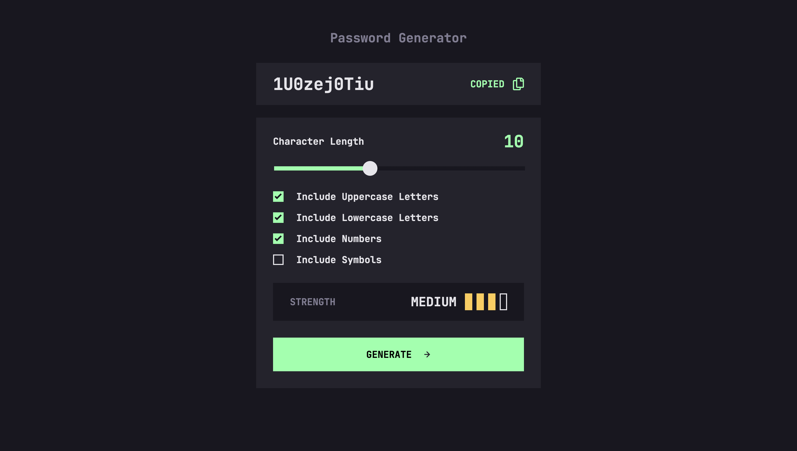

# Password Generator



The Password Generator is a responsive web app built with **React**, **Webpack**, and **Babel**. It allows users to generate customizable passwords, copy them to their clipboard, and view a strength rating. The app's responsive design ensures a seamless experience across all devices.

## How to run the project locally

```
npm install
npm run start
```

---

A big thank you to [Frontend Mentor](https://www.frontendmentor.io/) for providing the design and challenge for this project.
